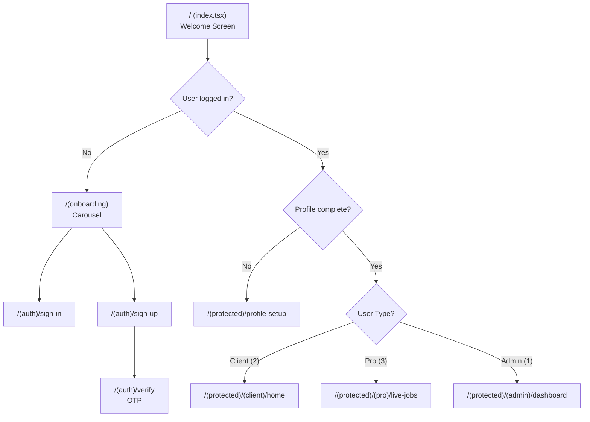
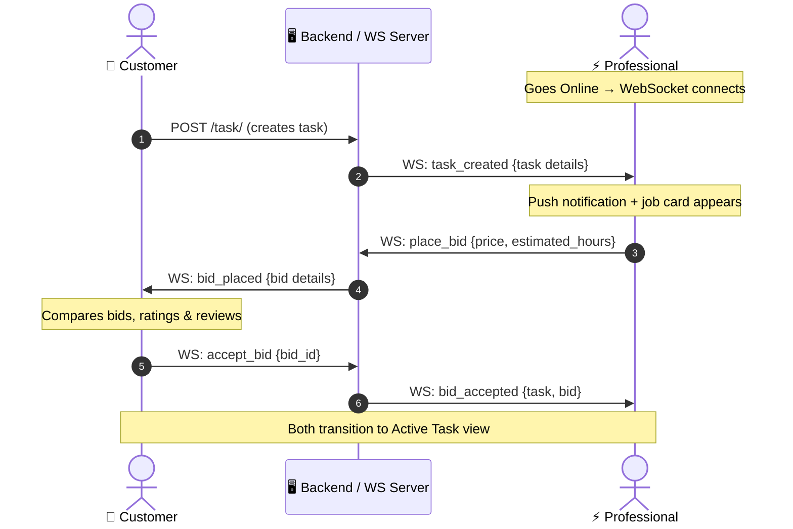

# 🛠️ KaamKarwao - On-Demand Services, Bidding & Admin Ecosystem

<p align="center">
  
</p>


<table align="center">
<tr>
<td align="center">

### 🎥 KaamKarwao Demo Video

<video
  src="https://github.com/user-attachments/assets/ae363c29-7017-44c1-b0b6-7505cb8d7bcd"
  width="400"
  controls>
</video>

</td>
</tr>
</table>

A premium, production-grade on-demand services marketplace built with **Expo SDK 54** and **React Native 0.81**. The platform connects **Customers** seeking home and technical services with **Professionals** who bid on jobs in real-time, all managed through a comprehensive **Admin Control Panel**. Features include real-time WebSocket bidding, polygon geofencing, persistent offline storage, JWT auto-refresh, push notifications, and a modular architecture across **183 source files**.

---

## Table of Contents

- [Technology Stack](#-technology-stack--integrations)
- [Architecture Overview](#-architecture-overview)
- [Project Structure](#-project-structure)
- [Routing & Navigation](#-routing--navigation)
- [State Management Strategy](#-state-management-strategy)
- [API & Networking Layer](#-api--networking-layer)
- [Real-Time Systems](#-real-time-systems-websockets)
- [Authentication & Session Management](#-authentication--session-management)
- [Design System & Styling](#-design-system--styling)
- [Key Production Features](#-key-production-features)
- [Platform Roles](#-platform-roles)
- [Design Patterns & Principles](#-design-patterns--principles)
- [Running Locally](#-running-locally)
- [Environment Variables](#-environment-variables)

---

## 🛠️ Technology Stack & Integrations

| Technology | Version / Badge | Purpose |
| :--- | :--- | :--- |
| **Expo SDK** |  | Cross-platform framework, build tooling, OTA updates |
| **React Native** |  | Native UI rendering engine (New Architecture enabled) |
| **TypeScript** |  | End-to-end type safety across all layers |
| **Expo Router** |  | File-based navigation with route groups & layouts |
| **Zustand** |  | Lightweight global state (7 stores) |
| **MMKV** |  | Synchronous key-value persistence (tasks, location, payment prefs, online status) |
| **TanStack Query** |  | Server-state caching, mutations, admin dashboard hooks |
| **React Hook Form + Zod** |  | Form state management with schema-based validation |
| **Firebase Auth** |  | Phone number OTP authentication via `@react-native-firebase/auth` |
| **Expo SecureStore** |  | Encrypted JWT token & session persistence |
| **Expo Notifications** |  | Local push notifications for new task alerts |
| **Expo Location** |  | Real-time GPS tracking for professionals |
| **React Native Maps** |  | Native Google Maps integration |
| **WebView + Leaflet** |  | Instant-mount interactive maps with Nominatim search |
| **react-native-agora** |  | Native in-app VoIP voice calling SDK |
| **Expo Image Picker** |  | Multi-media attachment selection |
| **WebSocket** |  | Live job feeds, bidding, task chat, and VoIP call signals |

---

## 🏗️ Architecture Overview

The application follows a **layered architecture** with clear separation of concerns:

```
┌─────────────────────────────────────────────────────────┐
│                    PRESENTATION LAYER                    │
│  src/app/        → Expo Router screens (thin wrappers)   │
│  src/pages/      → Full-screen view components           │
│  src/components/ → Reusable UI components                │
│  src/styles/     → Extracted StyleSheet definitions       │
├─────────────────────────────────────────────────────────┤
│                     BUSINESS LOGIC                        │
│  src/hooks/      → Custom hooks (WS, location, bidding)  │
│  src/context/    → React Context providers (auth, jobs)   │
├─────────────────────────────────────────────────────────┤
│                     STATE MANAGEMENT                      │
│  src/store/      → Zustand stores + MMKV persistence     │
├─────────────────────────────────────────────────────────┤
│                     DATA ACCESS LAYER                     │
│  src/services/   → API clients, fetch wrappers, WS       │
│  src/utils/      → Pure utility functions                 │
│  src/types/      → TypeScript interfaces & type exports   │
│  src/constants/  → Enums, color tokens, config values     │
└─────────────────────────────────────────────────────────┘
```

**Key architectural decisions:**
- **Route screens are thin wrappers** — `src/app/` files import and render view components from `src/pages/`, keeping routing logic separate from UI logic.
- **Styles are externalized** — Each major view has a dedicated `.styles.ts` file in `src/styles/`, preventing component files from becoming bloated.
- **Hooks encapsulate complex logic** — WebSocket management, location tracking, and task posting are extracted into dedicated hooks (`useProWebSocket`, `useHomeViewLocation`, `useHomeViewTaskPost`).
- **Services are single-responsibility** — Each backend entity (task, user, wallet, bidding, category, etc.) has its own service file with typed API functions.

---

## 📁 Project Structure

```
KaamKarwao/
├── .agents/                        # AI agent rules & workspace config
│   └── AGENTS.md                   # Project rules (SOLID, 500-line limit, git push control)
├── assets/                         # App icons, splash screens, showcase banners
├── src/
│   ├── app/                        # 📱 Expo Router — File-Based Navigation
│   │   ├── _layout.tsx             # Root layout (QueryClient, AuthProvider, ErrorBoundary, ThemeProvider)
│   │   ├── index.tsx               # Welcome / language selection screen
│   │   ├── (onboarding)/           # First-time user onboarding carousel
│   │   ├── (auth)/                 # Authentication flow
│   │   │   ├── sign-in.tsx         # Phone + password sign-in with step indicators
│   │   │   ├── sign-up.tsx         # Registration with Firebase phone verification
│   │   │   └── verify.tsx          # OTP verification screen
│   │   └── (protected)/            # Auth-guarded route group
│   │       ├── _layout.tsx         # Session guard (redirects unauthenticated users)
│   │       ├── profile-setup.tsx   # Post-registration profile completion
│   │       ├── (tabs)/             # Client bottom tab navigator
│   │       ├── (client)/           # Client-specific screens
│   │       │   ├── home.tsx        # → HomeView (map, categories, task posting)
│   │       │   ├── task-history.tsx # → TaskHistoryView
│   │       │   ├── wallet.tsx      # → WalletView
│   │       │   ├── edit-profile.tsx
│   │       │   ├── saved-addresses.tsx
│   │       │   ├── security-privacy.tsx
│   │       │   └── support-help.tsx
│   │       ├── (pro)/              # Professional-specific screens
│   │       │   ├── _layout.tsx     # Pro guard (usertype_id === 3)
│   │       │   ├── live-jobs.tsx   # → ProLiveJobsView (default landing)
│   │       │   ├── dashboard.tsx   # → ProDashboardView
│   │       │   ├── job-history.tsx # Job history with status filtering
│   │       │   ├── earnings.tsx    # Earnings breakdown
│   │       │   └── wallet.tsx      # → WalletView
│   │       └── (admin)/            # Admin-specific screens
│   │           ├── _layout.tsx     # Admin guard (usertype_id === 1)
│   │           ├── dashboard.tsx   # → AdminDashboardView
│   │           ├── users.tsx       # → AdminUsersView
│   │           ├── tasks.tsx       # → AdminTasksView
│   │           ├── bids.tsx        # → AdminBidsView
│   │           ├── categories.tsx  # → AdminCategoriesView
│   │           ├── reviews.tsx     # → AdminReviewsView
│   │           ├── earnings.tsx    # → AdminEarningsView
│   │           ├── financials.tsx  # → AdminFinancialsView
│   │           ├── attachments.tsx # → AdminAttachmentsView
│   │           ├── masterdata.tsx  # → AdminMasterDataView
│   │           ├── pro-detail.tsx  # → AdminProDetailView
│   │           └── settings.tsx    # → AdminSettingsView
│   │
│   ├── components/                 # 🧩 Reusable UI Components
│   │   ├── CustomButton.tsx        # Styled pressable button
│   │   ├── CustomInput.tsx         # Themed text input
│   │   ├── ErrorBoundary.tsx       # React error boundary with fallback UI
│   │   ├── ReviewModal.tsx         # Submit review modal
│   │   ├── UserReviewsModal.tsx    # View user reviews modal
│   │   ├── common/                 # Shared modals & primitives
│   │   │   ├── TaskChatModal.tsx   # Task chat modal with image attachments & VoIP trigger
│   │   │   ├── ChatMessageBubble.tsx # Message bubble for text & image attachments
│   │   │   ├── ChatImagePreviewModal.tsx # Full-screen image lightbox preview
│   │   │   ├── AgoraVoipCallModal.tsx # Native Agora RTC voice calling modal
│   │   │   └── IncomingCallModal.tsx  # Incoming ringing call modal
│   │   ├── client/                 # Client-specific components
│   │   │   ├── HomeMapView.tsx     # Leaflet/WebView map with pin adjustment
│   │   │   ├── HomeBottomSheet.tsx # Task posting bottom sheet (category, budget, description)
│   │   │   ├── HomeCategoryList.tsx # Category grid/horizontal list with selection states
│   │   │   ├── DrawerPanel.tsx     # Client navigation drawer
│   │   │   ├── PinAdjusterModal.tsx # Map pin location fine-tuning
│   │   │   ├── SearchLocationModal.tsx # Nominatim address search
│   │   │   ├── ClientBidsList.tsx  # Incoming bid cards display
│   │   │   ├── AcceptedProCard.tsx # Accepted professional info card
│   │   │   ├── TaskSummaryCard.tsx # Task overview card
│   │   │   ├── ClientChatModal.tsx # In-app chat with professional
│   │   │   ├── CancelProgressModal.tsx
│   │   │   └── SavedAddressForm.tsx
│   │   ├── pro/                    # Professional-specific components
│   │   │   ├── JobCard.tsx         # Live job listing card with bid actions
│   │   │   ├── JobDetailBottomSheet.tsx # Detailed job view with bidding
│   │   │   ├── jobDetailBottomSheet/   # Sub-components (Header, Description, Bidding sections)
│   │   │   ├── ProDrawerPanel.tsx  # Pro navigation drawer with online toggle
│   │   │   ├── ProActiveTaskModal.tsx  # Active task execution modal
│   │   │   ├── ProLiveJobsStates.tsx   # Empty/offline/loading state views
│   │   │   ├── ActiveBidListener.tsx   # WebSocket bid acceptance listener
│   │   │   └── ImagePreviewOverlay.tsx
│   │   ├── admin/                  # Admin panel components
│   │   │   ├── AdminDrawerPanel.tsx
│   │   │   ├── AdminHeader.tsx
│   │   │   ├── AdminStatCard.tsx
│   │   │   ├── CategoryModal.tsx
│   │   │   ├── CreateUserModal.tsx
│   │   │   ├── TaskDetailModal.tsx
│   │   │   ├── UserDetailModal.tsx
│   │   │   ├── category/           # CategoryCard, IconColorPicker, SubCategoryModal
│   │   │   └── common/             # Shared admin UI primitives
│   │   ├── profile-setup/          # Profile setup form components
│   │   │   ├── RoleSelector.tsx    # Client/Provider/Admin role picker
│   │   │   ├── GenderSelector.tsx
│   │   │   ├── DropdownSelector.tsx
│   │   │   ├── GpsCoordinatesField.tsx
│   │   │   ├── MapPickerModal.tsx  # Leaflet map for location selection
│   │   │   └── leafletHtml.ts      # Leaflet HTML template string
│   │   └── wallet/
│   │       └── WalletView.tsx      # Shared wallet component (client & pro)
│   │
│   ├── hooks/                      # 🪝 Custom React Hooks
│   │   ├── useTaskChatWebSocket.ts # Task chat WebSocket + attachment caching & resolution
│   │   ├── useProWebSocket.ts      # Global singleton WebSocket for live job feed
│   │   ├── useBiddingWebSocket.ts  # Per-task bidding WebSocket channel
│   │   ├── useHomeViewLocation.ts  # GPS + geocoding + MMKV location persistence
│   │   ├── useHomeViewTaskPost.ts  # Task creation orchestration hook
│   │   ├── useProLiveLocation.ts   # Professional GPS tracking
│   │   ├── useActiveBids.ts        # Active bid state management
│   │   ├── useProfileSubmit.ts     # Profile setup form submission
│   │   ├── useRouteByUserType.ts   # Post-auth routing by user role
│   │   └── admin/
│   │       └── useAdminDashboard.ts # TanStack Query hook for admin KPIs
│   │
│   ├── pages/                      # 📄 Full-Screen View Components
│   │   ├── client/
│   │   │   ├── HomeView.tsx        # Main client screen (map + categories + task flow)
│   │   │   ├── ActiveTaskScreen.tsx # Active task with bids, chat, and status tracking
│   │   │   ├── TaskHistoryView.tsx # Past tasks with status badges
│   │   │   └── ProfileView.tsx     # Client profile & settings
│   │   ├── pro/
│   │   │   ├── ProLiveJobsView.tsx # Live job feed with WebSocket + online toggle
│   │   │   └── ProDashboardView.tsx # Earnings charts, stats, quick actions
│   │   └── admin/                  # 12 admin module screens
│   │       ├── AdminDashboardView.tsx
│   │       ├── AdminUsersView.tsx
│   │       ├── AdminTasksView.tsx
│   │       ├── AdminBidsView.tsx
│   │       ├── AdminCategoriesView.tsx
│   │       ├── AdminReviewsView.tsx
│   │       ├── AdminEarningsView.tsx
│   │       ├── AdminFinancialsView.tsx
│   │       ├── AdminAttachmentsView.tsx
│   │       ├── AdminMasterDataView.tsx  # CRUD for 9 data tables
│   │       ├── AdminProDetailView.tsx
│   │       └── AdminSettingsView.tsx
│   │
│   ├── services/                   # 🌐 API Service Layer
│   │   ├── fetchClient.ts          # Core HTTP client (timeout, auth headers, JWT refresh, 401 retry)
│   │   ├── agoraService.ts         # Dynamic Agora RTC call token fetch (/app/message/room/{id}/call-token/)
│   │   ├── task.ts                 # Task CRUD, chain creation, attachment upload, getAttachmentById
│   │   ├── user.ts                 # User registration, login, profile updates
│   │   ├── bidding.ts              # Bid placement API
│   │   ├── wallet.ts               # Wallet GET/POST with auto-creation
│   │   ├── category.ts             # Categories & subcategories API
│   │   ├── location.ts             # Location chain creation & lookup
│   │   ├── customer.ts             # Customer profile & image normalization
│   │   ├── review.ts               # Review submission
│   │   ├── geofenceService.ts      # Polygon geofencing with ray-casting algorithm
│   │   ├── notificationService.ts  # Push notification registration & display
│   │   ├── proEarnings.ts          # Professional earnings API
│   │   ├── attachment.ts           # File upload & attachment API
│   │   ├── country.ts / city.ts / area.ts # Geographic hierarchy APIs
│   │   ├── masterData.ts           # Admin master data CRUD
│   │   ├── adminUsers.ts           # Admin user management API
│   │   ├── adminTasks.ts           # Admin task operations API
│   │   ├── adminEarnings.ts        # Admin earnings API
│   │   └── adminReviews.ts         # Admin reviews API
│   │
│   ├── store/                      # 🗃️ Global State Stores (Zustand + MMKV)
│   │   ├── taskStore.ts            # Task history & active task (MMKV-persisted, per-user)
│   │   ├── categoryStore.ts        # Categories & subcategories (lazy-loaded from API)
│   │   ├── locationStore.ts        # Last-known location (MMKV-persisted)
│   │   ├── paymentStore.ts         # Payment preferences (MMKV-cached)
│   │   ├── proOnlineStore.ts       # Professional online/offline status (MMKV-persisted)
│   │   ├── proEarningsStore.ts     # Professional earnings cache
│   │   └── proTaskStore.ts         # Professional task state
│   │
│   ├── context/                    # ⚛️ React Context Providers
│   │   ├── auth.tsx                # AuthProvider — session, login, logout, JWT sync
│   │   └── post-job.tsx            # PostJobProvider — task creation, bidding, chat state machine
│   │
│   ├── styles/                     # 🎨 Extracted StyleSheet Files
│   │   ├── taskChatModal.styles.ts # Chat modal & attachment bubble styles
│   │   ├── agoraVoipCallModal.styles.ts # VoIP call UI styles
│   │   ├── homeView.styles.ts      # Client home screen styles
│   │   ├── activeTaskScreen.styles.ts
│   │   ├── proLiveJobsView.styles.ts
│   │   ├── proDashboardView.styles.ts
│   │   ├── jobDetailBottomSheet.styles.ts
│   │   ├── proActiveTaskModal.styles.ts
│   │   ├── profileSetup.styles.ts
│   │   ├── onboarding.styles.ts
│   │   ├── verify.styles.ts
│   │   ├── wallet.styles.ts
│   │   ├── savedAddresses.styles.ts
│   │   ├── adminUsersView.styles.ts
│   │   ├── adminMasterDataView.styles.ts
│   │   └── userDetailModal.styles.ts
│   │
│   ├── types/                      # 📝 TypeScript Interfaces
│   │   ├── index.ts                # Core types (User, AppUser, Task, Bid, LiveJob, etc.)
│   │   ├── category.ts             # Category & SubCategory interfaces
│   │   └── admin.ts                # Admin-specific types
│   │
│   ├── constants/                  # 📌 App Constants
│   │   ├── colors.ts               # Design tokens — brand, pro, neutral, semantic palettes
│   │   ├── userTypes.ts            # USER_TYPE_ADMIN=1, USER_TYPE_CLIENT=2, USER_TYPE_PRO=3
│   │   ├── taskStatus.ts           # OPEN=1, ACCEPTED=2, CANCELLED_BY_SYSTEM=3, COMPLETED=4, CANCELLED=5
│   │   ├── locationData.ts         # Default location coordinates
│   │   ├── mockData.ts             # Development mock data
│   │   └── mockJobs.ts             # Mock job listings for testing
│   │
│   └── utils/                      # 🔧 Pure Utility Functions
│       ├── logger.ts               # Dev-only console logger (suppresses in production)
│       ├── taskMapper.ts           # BackendTask → local Task transformation
│       ├── distanceUtils.ts        # Haversine formula for distance calculation
│       └── attachmentUtils.ts      # File attachment helpers
│
├── app.config.js                   # Expo config (Firebase, Google Maps, EAS)
├── tsconfig.json                   # TypeScript configuration with path aliases (@/)
├── babel.config.js                 # Babel with expo preset
├── .env.example                    # Environment variable template
└── package.json                    # Dependencies & scripts
```

---

## 🧭 Routing & Navigation

The app uses **Expo Router v6** with file-based routing and **route groups** for role separation:



**Route Guards:**
- `(protected)/_layout.tsx` — Redirects unauthenticated users to `/` and incomplete profiles to `/profile-setup`
- `(pro)/_layout.tsx` — Verifies `usertype_id === USER_TYPE_PRO`, redirects others to client home
- `(admin)/_layout.tsx` — Verifies `usertype_id === USER_TYPE_ADMIN`
- `useRouteByUserType` hook — Centralized post-auth routing logic used by welcome screen and profile setup

---

## 🗃️ State Management Strategy

The app uses a **multi-layer state strategy** tailored to data lifetime and access patterns:

| Layer | Tool | Persistence | Use Cases |
|---|---|---|---|
| **Server State** | TanStack Query v5 | In-memory cache (5min stale) | Admin dashboard KPIs, API data with refetch |
| **Global App State** | Zustand v5 | In-memory + MMKV | Categories, tasks, location, online status, earnings |
| **Auth State** | React Context | SecureStore (encrypted) | User session, JWT tokens, login/logout |
| **Job Flow State** | React Context | Zustand/MMKV backing | Active task lifecycle, bids, chat messages |
| **Form State** | React Hook Form + Zod | Component-local | Profile setup, sign-in, sign-up validation |
| **Component State** | useState/useRef | Component-local | UI toggles, animations, modals |

### Zustand Stores (7 total)

| Store | File | Persistence | Description |
|---|---|---|---|
| `useTaskStore` | `taskStore.ts` | MMKV (per-user key) | Task history & active task with user-scoped MMKV keys |
| `useCategoryStore` | `categoryStore.ts` | In-memory | Categories & subcategories with lazy `ensureCategories()` |
| `useLocationStore` | `locationStore.ts` | MMKV | Last-known GPS coordinates for instant map mount |
| `usePaymentStore` | `paymentStore.ts` | MMKV | Payment preferences cache with background sync |
| `useProOnlineStore` | `proOnlineStore.ts` | MMKV | Professional online/offline toggle state |
| `useProEarningsStore` | `proEarningsStore.ts` | In-memory | Professional earnings aggregation |
| `useProTaskStore` | `proTaskStore.ts` | In-memory | Professional active task state |

---

## 🌐 API & Networking Layer

### `fetchClient.ts` — Core HTTP Client

All API calls flow through a centralized fetch client with these capabilities:

```
Request → getAuthHeaders() → fetchWithTimeout(15s) → Response
                │                                        │
                │ Proactive refresh                       │ 401?
                │ (token > 30min old)                     │
                ▼                                        ▼
        refreshAndPersistToken()              refreshAndPersistToken()
                │                                        │
                ▼                                        ▼
        Update SecureStore                      Retry request once
        Update user_session                     with new token
```

**Key features:**
- **JWT Auto-Refresh** — Proactively refreshes tokens older than 30 minutes via `getAuthHeaders()`
- **401 Retry** — On unauthorized response, refreshes the token and retries the request once
- **15s Timeout** — All requests have an `AbortController` timeout
- **Idempotent Retry** — Network errors on GET/PUT/DELETE are retried; POST is not (prevents duplicates)
- **Token Sync** — New tokens are persisted to both `SecureStore` and the `user_session` JSON

### Service Layer (21 files)

Each backend entity has a dedicated service file:

| Service | File | Key Functions |
|---|---|---|
| **Tasks** | `task.ts` | `createTaskChain`, `getUserTasksFromBackend`, `getOpenTasksFromBackend`, `softDeleteTaskOnBackend` |
| **Users** | `user.ts` | `createUser`, `loginUser`, `verifyUserOnBackend`, `updateProfilePic` |
| **Wallet** | `wallet.ts` | `getWalletByUserId` (with auto-creation on 404), `createWalletForUser` |
| **Bidding** | `bidding.ts` | Bid placement via REST API |
| **Categories** | `category.ts` | `getCategories`, `getSubcategories`, CRUD operations |
| **Location** | `location.ts` | `getOrCreateLocationChain`, `getLocationById` |
| **Geofence** | `geofenceService.ts` | Ray-casting polygon engine with real-world city boundaries |
| **Notifications** | `notificationService.ts` | Push notification setup and display |
| **Admin services** | `adminUsers.ts`, `adminTasks.ts`, etc. | Admin-specific CRUD operations |

---

## ⚡ Real-Time Systems (WebSockets)

The app maintains **two WebSocket channels** for different real-time use cases:

### 1. Pro Live Jobs WebSocket (`useProWebSocket.ts`)

- **Scope:** Global singleton — persists across tab navigation and app backgrounding
- **Purpose:** Receives `task_created` broadcasts when customers post new jobs
- **Triggers:** Push notification (`notificationService.ts`) on each new task
- **Messages:** `task_created`, `task_deleted`, `heartbeat`
- **Auto-reconnect:** Exponential backoff with connection status tracking
- **Data enrichment:** Resolves location names, customer profiles, category metadata, and distance calculations in parallel after receiving a task

### 2. Bidding WebSocket (`useBiddingWebSocket.ts`)

- **Scope:** Per-task connection — created when a professional opens a job detail or when a customer is receiving bids
- **Purpose:** Real-time bid placement, acceptance, and bidding closure
- **Messages:** `bid_placed`, `bid_accepted`, `bid_history`, `bidding_closed`
- **Actions:** `placeBid()`, `acceptBid()`, `closeSocket()`

### 3. Task Chat & VoIP Signaling WebSocket (`useTaskChatWebSocket.ts`)

- **Scope:** Per-task connection created when entering a active task chat room
- **Purpose:** Real-time messaging, image attachment delivery, and WebRTC ringing signals
- **Messages:** `send_message`, `message_received`, `message_history`, `[VOICE_CALL_SIGNAL:...]`
- **Capabilities:** Automatic attachment URL resolution, message history pagination (`fetchOlderMessages`), and ringing call triggers

### Real-Time Interaction Flow



### 🎙️ Native Agora VoIP Calling System

The app features cross-platform native audio calling powered by **`react-native-agora` v4.6.2**:

- **Dynamic Token Endpoint:** Fetches RTC tokens from `GET ${API_URL}/app/message/room/${taskId}/call-token/` (`agoraService.ts`).
- **Channel Authorization:** Binds `currentUserId` (`Number(user.id)`) to `engine.joinChannel(token, channel_name, currentUserId)` matching backend authorization.
- **In-App Call Controls:** Active duration timer, microphone mute (`muteLocalAudioStream`), speakerphone toggle (`setEnableSpeakerphone`), and remote user listener (`onUserJoined`, `onUserOffline`).
- **WebSocket Call Signals:** Ringing modal (`IncomingCallModal.tsx`) triggered via `[VOICE_CALL_SIGNAL:incoming_call:...]` socket payloads.

### 🖼️ Chat Attachment & Resolution Cache

- **Multipart Upload:** Image attachments are uploaded via `POST /app/attachment/` returning `{ id, url }`.
- **Immediate Local Cache:** Uploaded URLs are cached locally instantly in `attachmentCache[id]` for zero-latency rendering.
- **Automatic Fallback Resolution:** Inbound messages with `attachment_id` query `GET /app/attachment/${attachmentId}/`, with automatic fallback to `GET /app/attachment/${taskId}/` if single lookup yields empty array.
- **Full-Screen Lightbox:** Tapping chat images opens `ChatImagePreviewModal.tsx` for full-screen preview.

---

## 🔐 Authentication & Session Management

### Flow

```
Firebase Phone Auth (OTP) → Backend JWT Login → SecureStore Persistence
```

1. **Registration:** Firebase phone verification → OTP code → `verifyUserOnBackend()` → `createUser()` → backend JWT
2. **Login:** Phone + password → `loginUser()` → backend JWT (access + refresh tokens)
3. **Session persistence:** JWT tokens + user object stored in `expo-secure-store` (encrypted)
4. **Session restoration:** On app launch, `AuthProvider.loadSession()` restores from `SecureStore`
5. **Token refresh:** `fetchClient.ts` automatically refreshes tokens older than 30 minutes

### Session Storage Layout

| SecureStore Key | Content |
|---|---|
| `user_session` | Full `AppUser` JSON (profile + token) |
| `user_token` | JWT access token |
| `user_refresh_token` | JWT refresh token |
| `user_token_saved_at` | Timestamp for proactive refresh |

---

## 🎨 Design System & Styling

### Color Tokens (`constants/colors.ts`)

The app uses a centralized color system with distinct palettes:

| Palette | Usage | Example Colors |
|---|---|---|
| `Colors.brand.*` | Client-facing UI | `dark: #0B5A3E`, `medium: #16A34A`, `amber: #D97706` |
| `Colors.pro.*` | Professional dark theme | `bg: #0B1A12`, `accent: #22C55E`, `card: #132218` |
| `Colors.neutral.*` | Grays (50–900 scale) | `400: #9CA3AF`, `700: #374151` |
| `Colors.success/warning/error/info` | Semantic | Green, amber, red, blue |

### Styling Architecture

- **Separated StyleSheets** — 14 dedicated `.styles.ts` files in `src/styles/`
- **No inline style objects** for complex views — all extracted to named style constants
- **Platform-aware** — Conditional styles for iOS vs Android (e.g., shadow vs elevation)
- **Animated components** — Uses `Animated` API for drawer slides, shimmer loading, and scale transitions

---

## 🚀 Key Production Features

### For Customers
- **Instant Map Mount** — Leaflet map loads from MMKV cache with zero delay, then smoothly pans when GPS resolves
- **Polygon Geofence Validation** — Ray-casting algorithm validates if selected location falls within serviceable city boundaries (Lahore & Islamabad polygons)
- **Multi-Step Task Creation** — Category → subcategory → description → budget → location → attachments → submit
- **Real-Time Bid Comparison** — Live WebSocket bids with professional profiles, ratings, and estimates
- **Progressive Auth Loading** — Step-by-step indicators during sign-in ("Authenticating...", "Fetching profile...", "Syncing...")
- **Digital Wallet** — Balance display with auto-creation, pull-to-refresh, and error retry
- **Saved Addresses** — CRUD for frequently used locations

### For Professionals
- **Live Job Feed** — WebSocket-powered real-time job stream with distance calculation
- **Push Notifications** — Local notifications for new tasks even when app is backgrounded
- **Online/Offline Toggle** — Persistent MMKV-backed status that controls WebSocket connection
- **Bidding Interface** — Custom bid submission with price and time estimates
- **Earnings Dashboard** — Weekly bar charts, daily/total earnings, job completion stats
- **GPS Location Tracking** — Real-time location updates for proximity-based job matching
- **Active Task Management** — Task execution modal with status updates

### For Administrators
- **17-Module Control Panel** — Dashboard, Users, Tasks, Bids, Categories, Reviews, Earnings, Financials, Attachments, Master Data, Pro Detail, Settings
- **Master Data CRUD** — Full create/read/update/delete for 9 core database tables
- **User Verification** — Toggle verification status for professionals
- **TanStack Query Integration** — Efficient data fetching with caching for all admin views

---

## 👥 Platform Roles

| Role | ID | Default Route | Key Capabilities |
|---|---|---|---|
| **Admin** | 1 | `/(admin)/dashboard` | Full platform oversight, user management, master data CRUD |
| **Customer** | 2 | `/(client)/home` | Post tasks, compare bids, manage wallet, chat with pros |
| **Professional** | 3 | `/(pro)/live-jobs` | Receive jobs via WebSocket, place bids, track earnings |

---

## 🧬 Design Patterns & Principles

### SOLID Principles Applied

| Principle | Implementation |
|---|---|
| **Single Responsibility** | Each service file handles one entity; hooks encapsulate one concern; styles are separated from components |
| **Open/Closed** | `fetchClient.ts` is extended via `fetchWithAuth` wrapper without modifying the base `fetchWithTimeout` |
| **Liskov Substitution** | `AppUser extends User` — substitutable in all contexts expecting `User` |
| **Interface Segregation** | Focused interfaces: `UseProWebSocketOptions`, `UseBiddingWebSocketOptions` — callers only depend on what they need |
| **Dependency Inversion** | Components depend on store interfaces (`useTaskStore`, `useAuth`) rather than direct API calls |

### Key Patterns

| Pattern | Where |
|---|---|
| **Provider Pattern** | `AuthProvider`, `PostJobProvider` — context-based dependency injection |
| **Singleton** | `useProWebSocket` — module-level global WebSocket prevents duplicate connections |
| **Repository/Service** | `src/services/` — each file is a repository abstracting REST endpoints |
| **Store/Mediator** | Zustand stores mediate between MMKV persistence and React state |
| **Mapper** | `taskMapper.ts` — transforms backend DTOs to local domain models |
| **Guard** | Route `_layout.tsx` files act as navigation guards based on auth and role |
| **Observer** | WebSocket hooks observe server events and dispatch state updates |

### Enforced Rules (`.agents/AGENTS.md`)

- **500-line file limit** — No source file should exceed 500 lines; modularize into subcomponents/hooks
- **Git push control** — Only push when explicitly requested
- **Production-level practices** — Robust error handling, proper logging, clean state management, type safety
- **Project structure adherence** — Follow established directory conventions

---

## 🚀 Running Locally

### Prerequisites
- Node.js 18+
- Expo CLI (`npx expo`)
- Android Studio (for Android builds) or Xcode (for iOS)
- A running backend API server

### 1. Install Dependencies
```bash
npm install
```

### 2. Environment Variables
Create a `.env` file in the root directory (see `.env.example`):
```env
EXPO_PUBLIC_API_URL=https://your-api-domain.com/
```

### 3. Firebase Configuration
- Place `google-services.json` (Android) in the project root
- Place `GoogleService-Info.plist` (iOS) in the project root
- Both are configured in `app.config.js`

### 4. Run Development Server
```bash
# Start with Expo dev client
npx expo start

# Run directly on Android device
npx expo run:android --device

# Run on iOS simulator
npx expo run:ios
```

### 5. Build Standalone Production Release APK
To compile a standalone, signed production Android release APK locally:

```powershell
cd android; .\gradlew assembleRelease; cd ..
```

📁 **Generated APK Output Location:**
`android\app\build\outputs\apk\release\app-release.apk`

### 6. Available Scripts
```bash
npm start          # Start Expo dev server
npm run android    # Build & run on Android
npm run ios        # Build & run on iOS
npm run web        # Start web bundle
```

---

## 📌 Environment Variables

| Variable | Required | Description |
|---|---|---|
| `EXPO_PUBLIC_API_URL` | ✅ | Backend API base URL (e.g., `https://api.kaamkarwao.com/`) |
| `EXPO_PUBLIC_AGORA_APP_ID` | ✅ | Agora App ID for native VoIP voice calls |


---

<p align="center">
  Built with ❤️ using Expo & React Native
</p>
